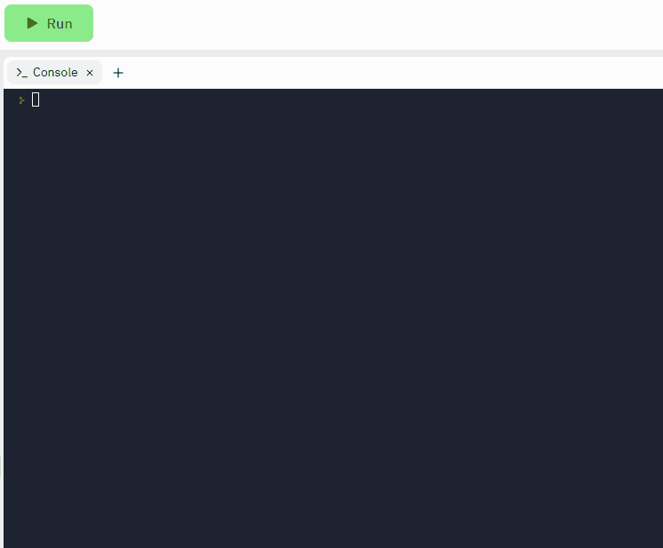

# Blue team vs. Red team!

## Instructions  

1. Assume that we have 58 people playing a game.
2. Loop over this number.
3. If the person has an even number, print out the word 'blue team'.
4. If it is odd, print out the word 'red team'.

## Sample Output
